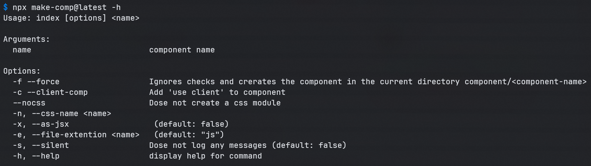

# make-comp(onent)

_the name was taken…_

**A command line interface (CLI) tool to creates a react component in your `src/components/` directory.**

See on [npm page](https://www.npmjs.com/package/make-comp)

# **_Usage_**

```
npx make-comp <component-name> <options>
```

# **_Component_**

**Path**

```
<project>/src/components/<component>/<component>.js
```

**File**

```jsx
'use client'; // can be added with '-c' option
import React from 'react';
import styles from 'componentName.module.css'; // can be removed with '--nocss' option

function ComponentName({}) {
  return <div>ComponentName</div>;
}

export default ComponentName;
```

**Structure**

```
<project>/
└── src/
    └── components/
        └── ComponentName/
            ├── ComponentName.js
            └── componentName.module.css
```

---

# Command



### Defaults

|                    |                          |
| ------------------ | ------------------------ |
| File Extension     | .js                      |
| Creates CSS Module | true                     |
| CSS Module Name    | componentName.module.css |
|                    |                          |

### Passing Component Name

The component name is passed directly after the command

```
$ npx make-comp <component-name>
```

```
$ npx make-comp cardGridHorizontal
```

> CardGridHorizontal

**An** **alternative** method would by to multiple names separated by a space, the component name will be the concatenation of all the names in `Pascal` casing.

```
$ npx make-comp card grid horizontal
```

> CardGridHorizontal

**_Note_** -- Please make sure that the component name is a valid `js` variable name.

---

### Options

|                                      |     |                  |                |
| ------------------------------------ | --- | ---------------- | -------------- |
| Add “use client”                     | -c  | --client-comp    |                |
| Do not create a CSS module           |     | --nocss          |                |
| Pass a name for your CSS module      | -n  | --css-name       | takes a string |
| Creates a .jsx file instead of a .js | -x  | --as-jsx         |                |
| Pass an alternative file extension   | -e  | --file-extension | takes a string |
| Create an index.js file              | -i  | --index          |                |
| No logs are outputted                | -s  | --silent         |                |
|                                      |     |                  |                |

---

> _Sorry for any bugs, I tested it and it seems to work fine._
